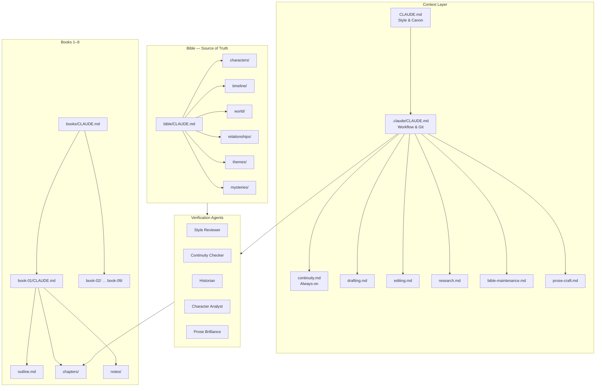
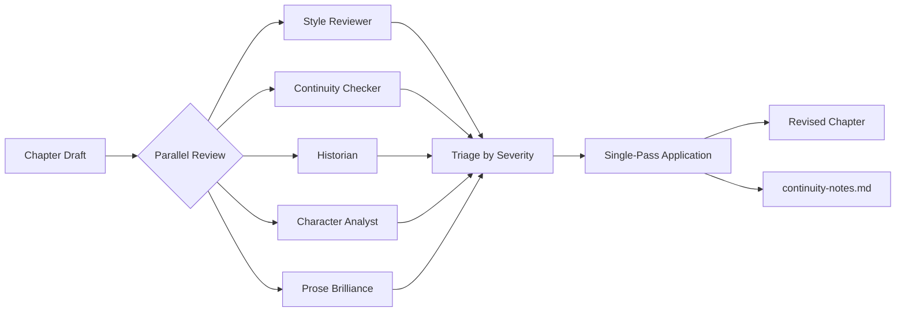
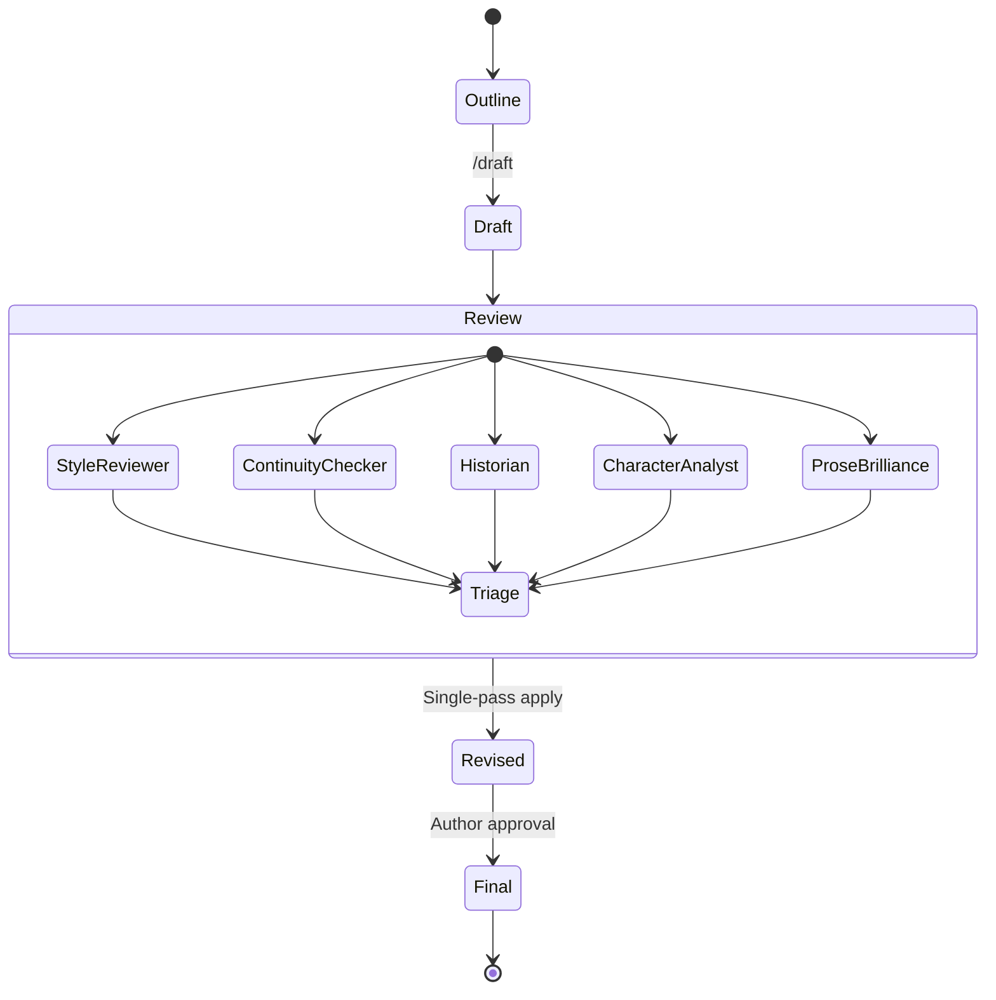
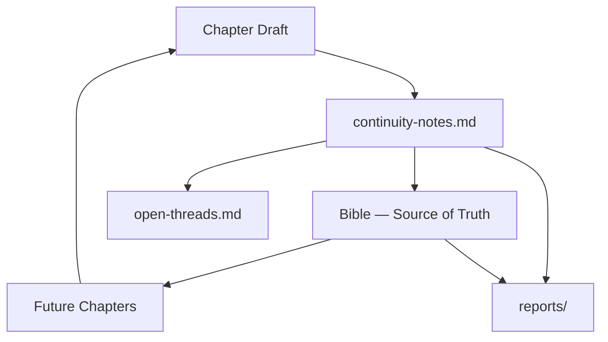

# Untamed Pursuit

### A 9-Book Historical Fiction Series — Written in Public

[](LICENSE-CONTENT.md)
[](LICENSE-TOOLS.md)
[](#)
[](#read-the-book)

> Philadelphia, 1846. A 25-year-old Chinese-American woman builds a shipping
> empire by day and dismantles a human trafficking network by night — armed
> with a sword cane, a black dog the size of a small bear, and a fortune most kings would envy.

---

## Part I: The Novel

### About the Series

**Untamed Pursuit** is a 9-book continuous historical fiction series spanning the American frontier from 1846 to the 1880s. Two eras. Two protagonists. One interconnected world.

**Era 1 — Fortune's Tide** (Books 1–4): Clara Chen, 25, runs a covert protection network from Philadelphia's docks while building a shipping empire. She meets Samuel Taylor during a child-trafficking rescue, and together they build partnerships that stretch across a continent — from the cobblestones of Philadelphia to the cliffs of Monterey. Her oldest friend Thomas Arlington manages her holdings. Her security chief Harper walks the docks at night. Her dog George moves between lethal weapon and children's comfort with a handler's signal. Clara gives away the fortune of many kings. It is not enough.

**Era 2 — FIERCE** (Books 5–9): Eve Garrett inherits Clara's network and carries it into a new generation. Trained from age five by a woman who saw in her the future of the fight, Eve must prove that the machinery of protection can survive its creator. New threats. New alliances. The same question: how far will you go to defend those who cannot defend themselves?

<!-- PROGRESS:START -->
### The Series

| Book | Title | Era | Setting | Status |
|---|---|---|---|---|
| 1 | Fortune's Tide | Era 1 | Philadelphia, ~1846 | Drafting — 24 of 36 chapters outlined |
| 2 | *(TBD)* | Era 1 | The Voyage West | Drafting — 3 of 0 chapters outlined |
| 3–4 | *(TBD)* | Era 1 | Building the Network | Planned |
| 5–9 | *(TBD)* | Era 2 | FIERCE — Eve's Story | Planned |

### Read the Book

The series is free to read. Start here:

**Book 1: Fortune's Tide** — [`books/book-01/chapters/`](books/book-01/chapters/)

| Ch | Title | POV | Words |
|---:|-------|-----|------:|
| 1 | [The Night Watch](books/book-01/chapters/ch-01.md) | Clara Chen | 3,474 |
| 2 | [The Machinery](books/book-01/chapters/ch-02.md) | Clara Chen | 2,938 |
| 3 | [Ginger and Steel](books/book-01/chapters/ch-03.md) | Clara Chen | 3,513 |
| 4 | [The Artist's Touch](books/book-01/chapters/ch-04.md) | Samuel Taylor | 3,262 |
| 5 | [The Measure](books/book-01/chapters/ch-05.md) | Clara Chen | 2,652 |
| 6 | [The Current](books/book-01/chapters/ch-06.md) | Clara Chen | 2,872 |
| 7 | [The Balance](books/book-01/chapters/ch-07.md) | Samuel Taylor | 3,610 |
| 8 | [The Boundary](books/book-01/chapters/ch-08.md) | Clara Chen | 3,402 |
| 9 | [The Reckoning](books/book-01/chapters/ch-09.md) | Clara Chen | 3,791 |
| 10 | [The Good Silver](books/book-01/chapters/ch-10.md) | Samuel Taylor | 4,267 |
| 11 | [The Reach](books/book-01/chapters/ch-11.md) | Clara Chen | 2,941 |
| 12 | [What the Ships Carry](books/book-01/chapters/ch-12.md) | Samuel Taylor | 3,392 |
| 13 | [The Night's Work](books/book-01/chapters/ch-13.md) | Clara Chen | 4,097 |
| 14 | [Below the Waterline](books/book-01/chapters/ch-14.md) | Clara Chen | 2,720 |
| 15 | [The Ledger](books/book-01/chapters/ch-15.md) | Samuel Taylor | 3,074 |
| 16 | [The Turning](books/book-01/chapters/ch-16.md) | Clara Chen | 2,847 |
| 17 | [The Orchard](books/book-01/chapters/ch-17.md) | Clara Chen | 2,901 |
| 18 | [The Manifest](books/book-01/chapters/ch-18.md) | Samuel Taylor | 2,638 |
| 19 | [Morning Tide](books/book-01/chapters/ch-19.md) | Clara Chen | 2,948 |
| 20 | [Open Water](books/book-01/chapters/ch-20.md) | Samuel Taylor | 3,163 |
| 21 | [The Windward Passage](books/book-01/chapters/ch-21.md) | Clara Chen | 2,438 |
| 22 | [The Harbor](books/book-01/chapters/ch-22.md) | Samuel Taylor | 2,207 |
| 23 | [The Chagres](books/book-01/chapters/ch-23.md) | Clara Chen | 2,189 |
| 24 | [The Mule Trail](books/book-01/chapters/ch-24.md) | Samuel Taylor | 3,938 |

*Book 1: ~75,270 words drafted* · *Series total: ~75,270 words*

**Book 2: *(TBD)*** — [`books/book-02/chapters/`](books/book-02/chapters/)

| Ch | Title | POV | Words |
|---:|-------|-----|------:|
| 1 | [The Narrowing Trail](books/book-02/chapters/ch-01.md) | Clara Chen | 3,311 |
| 2 | [Panama City](books/book-02/chapters/ch-02.md) | Clara Chen | 3,254 |
| 3 | [Before Dawn](books/book-02/chapters/ch-03.md) | Clara Chen | 3,187 |

*Book 2: ~9,750 words drafted* · *Series total: ~85,030 words*
<!-- PROGRESS:END -->

<!-- METRICS:START -->
### Series Dashboard

**9 books planned** · **2 in progress** · **~85,030 of ~500,000 estimated words**

```
Series Progress
[███████░░░░░░░░░░░░░░░░░░░░░░░░░░░░░░░░░] 17%
```

| | Book 1 | Book 2 | Books 3-9 |
|---|---|---|---|
| **Chapters** | 24 of 36 outlined | 3 | -- |
| **Words** | 75,270 | 9,750 | -- |
| **POV** | Clara (15) · Samuel (9) | Clara (3) | -- |

*27 chapters · 85,026 words · 3,149 avg words/chapter*
<!-- METRICS:END -->

### Themes

The series explores power, protection, betrayal, and legacy across generations. What does it cost to build something that outlasts you? What happens to the people left managing while the builder's world expands? How does trust become a weapon when it is taken for granted?

Every book carries forward the mysteries, promises, and debts of the books before it. Characters age. Scars persist. Oaths are remembered. The dead stay dead.

---

## Part II: The Engineering

### The Problem

Writing a 9-book series with shared characters, a sequential timeline, and an interconnected world is an information management problem. A character wounded in Book 2 carries that scar in Book 7. A promise made in Chapter 3 must be paid off or deliberately subverted. An 1846 Philadelphia street cannot have electric lights. A betrayal planted as invisible seeds in early chapters must read as charming warmth on first pass and retroactive poison on re-read.

A single author holding all of this in memory across years of writing will drop threads, contradict facts, and drift from established voice. This repository is designed to prevent that — to make the connective tissue of the series explicit, auditable, and machine-readable.

### Architecture

The system uses a hierarchy of `CLAUDE.md` files and scoped rules to provide context-appropriate instructions at every level of the project:



**20 `CLAUDE.md` files** provide layered context: the root file establishes prose style and canon rules; `.claude/CLAUDE.md` governs workflow; each bible subdirectory has its own conventions; each book carries its premise, POV assignments, and mystery tracking. When working on Book 1 Chapter 3, the system loads Book 1's context, the bible rules, the continuity rules, and the drafting-mode instructions — automatically scoped to the task.

**6 scoped rules** activate by work mode and file path. The continuity and prose-craft rules are always on. Drafting, editing, research, and bible-maintenance rules activate when you enter those modes. Each rule carries a different mindset: drafting is expansive ("don't stop to edit, flag and keep moving"); editing is surgical ("every change must earn its place"); research demands citations; bible maintenance requires reading before writing and updating both sides of every relationship.

### The Verification Pipeline

Every chapter passes through five parallel subagent reviews before revisions are applied:



| Subagent | What It Checks | Example Findings |
|---|---|---|
| **Style Reviewer** | POV discipline, tense consistency, dialogue tags, narrative beat structure, pacing | "Line 114: POV break — narrator is inside Thomas's head. Re-anchor in Clara's observation." |
| **Continuity Checker** | Cross-references every fact against the bible, previous chapters, and a per-chapter checklist | "Thomas's desk described as 'governor's estate auction' but bible says 'governor's office.' Update bible to match (more specific)." |
| **Historian** | Period vocabulary, interior details, legal/social frameworks, anachronism flags | "'Operational' is a 20th-century coinage — removed label; surrounding prose already conveys the shift." |
| **Character Analyst** | Voice consistency, re-read checks (do betrayal seeds read as charming on first pass?), emotional truth | "Thomas reads as warm and lovable. 'Not once — not once' works as teasing on first read; edge visible only on re-read. Defensible; monitor in beta." |
| **Prose Brilliance** | Competence traps, admiration problems, voice blurring, unearned narrative claims | "Clara solving three problems in one paragraph triggers competence-porn alarm. Let one attempt fail." |

The subagents run in parallel, return structured reports, and their findings are triaged by severity:

1. **Continuity errors** — fixed immediately (highest priority: the bible is canon)
2. **POV/tense/voice** — fixed in the same pass
3. **Period accuracy** — vocabulary swapped, details corrected, deliberate anachronisms flagged for author decision
4. **Character/pacing** — assessed and applied or deferred to revision

All findings are logged in `notes/continuity-notes.md` with the subagent's name, the finding, and the resolution. This creates an auditable trail: every decision has a reason, every fix has a source, and future chapters can reference what was caught and how it was handled.

### Chapter Lifecycle

Every chapter moves through a defined state machine from outline to final:



A chapter's `status` field in its YAML frontmatter tracks its current state (`draft`, `revised`, `final`). The `/revise` skill triggers the Review composite state, running all five agents in parallel before triaging findings into a single application pass.

### Data Flow

Information flows in a cycle: drafts generate new facts, which update the bible, which constrains future drafts.



Each drafting session produces continuity notes that feed the bible and update open threads. The bible then provides canon for the next chapter. Reports aggregate findings across the project. This circular flow ensures no fact exists only in the context window — everything is written to disk.

### The Continuity System

The continuity problem scales quadratically. Book 1 checks against the bible. Book 5 checks against the bible *and* four books of established facts. Book 9 checks against everything.

The system manages this through layered tracking:

**Per-chapter continuity notes** log every new fact introduced (Thomas's desk came from a governor's estate auction), every outline deviation (Harper returns for the cleanup scene — was that in the plan?), and every continuity flag (Samuel knows Harper's name before introduction — intentional mystery plant or error?). Each entry tracks whether it's been added to the bible.

**The bible** is the single source of truth. 24 character profiles with physical descriptions, speech patterns, arcs, relationships, and continuity notes. World-building files covering locations, politics, culture, technology, and period language. A mysteries file tracking every open thread, planted clue, and narrative debt — each with a status (`planted`, `developing`, `resolved`, `subverted`, `abandoned`).

**The always-on continuity rule** loads for every task. It lists common traps — character ages, scars, knowledge boundaries, travel times, seasonal details, promises and oaths, death permanence, skill consistency — and enforces a protocol: never silently resolve a discrepancy. Flag it. Log it. Don't change the bible without approval.

**YAML frontmatter on every chapter** provides machine-readable metadata: which threads were advanced, which were introduced, what the word count is, whether there are unresolved continuity flags. This makes it possible to query the series state programmatically: "Which chapters advance the Thomas betrayal thread?" "Where was Samuel's warehouse first mentioned?"

<!-- THREADS:START -->
### Narrative Debt

**13 threads tracked** · **7 planted** · **4 developing** · **1 partially resolved** · **1 resolved**

| Thread | Status | Planted | Latest |
|--------|--------|---------|--------|
| Thomas Arlington's Betrayal | Resolved | Book 1, Ch 2 | Book 2, Ch 25 |
| The Venezuela Crisis | Planted | One_year_after_Venezuela_crisis (refe... | -- |
| Eve's Canyon Ambush | Planted | Jessie_considers_Art (prompt notes: "... | -- |
| Clara's Full Network Scope | Developing | Multiple files (Episode I, Part_One, ... | -- |
| Jack's Southern Base Plan | Developing | Book 2, Ch 26 | Book 2, Ch 26 |
| Captain Andrews | Planted | Jessie_considers_Art | -- |
| Deliberate Well Poisoning | Planted | Jack_meet_Clara | -- |
| Durand Family Conspiracy | Developing | outline_for_fierce_11_27 (FIERCE 4-ac... | -- |
| Wallace Betrayal | Partially resolved | Book 1, Ch 3 | Book 2, Ch 24 |
| The Traitor Who Knew Glass Garden Layout | Planted | outline_for_fierce_11_27 (FIERCE Act II) | -- |
| The Informed Ambush | Planted | Book 2, Ch 1 | Book 2, Ch 25 |
| Clara's Progressive Disarmament Pattern | Developing | Book 1, Ch 1 | -- |
| Clara's Father Wound | Planted | Book 1, Ch 6 | Book 1, Ch 6 |

*Plant-to-resolution ratio: 11:2*
<!-- THREADS:END -->

### Design Principles

**Write state to files, not memory.** The context window is finite; the filesystem is not. Every decision, every fact, every subagent finding goes on disk. Sessions end; files persist.

**The bible wins.** When a draft contradicts the bible, the bible is correct. This prevents drift across books and across sessions. New facts introduced in drafts are logged and proposed for bible inclusion — they don't silently overwrite canon.

**Earlier books take precedence.** In any factual conflict, the earlier book's established facts are canon. This prevents retconning.

**Parallel review, sequential application.** Five subagents analyze independently. Their findings are merged, triaged by severity, and applied in a single pass. This prevents one reviewer's changes from creating issues for another's findings.

**Dual-frequency design.** Some narrative elements are designed to read differently on first pass versus re-read. The character analyst explicitly checks for this: does Thomas read as charming now? Will these same lines curdle after the betrayal? This requires a verification pass that most writing processes skip entirely.

### For Writers: Use the Tools

The series bible system, `CLAUDE.md` conventions, verification pipeline, and continuity tracking in this repo are MIT-licensed. Use them freely for your own projects:

- [Series Bible Structure](bible/) — Character profiles, timeline, world-building, relationship maps
- [CLAUDE.md Conventions](CLAUDE.md) — AI-assisted writing workflow and style guide
- [Character Template](bible/characters/_template.md) — Reusable character profile format
- [Continuity Rules](.claude/rules/continuity.md) — Always-on cross-book fact-checking protocol
- [Drafting / Editing / Research Rules](.claude/rules/) — Mode-specific writing instructions

---

## Adaptation Rights

All adaptation rights are reserved. The story text, characters, and world
are free to read and share under CC BY-NC-ND 4.0, but film, television,
game, audiobook, and all other adaptation rights require written consent.

See [LICENSE-CONTENT.md](LICENSE-CONTENT.md) for full details.

For licensing inquiries: **b@thegoatnote.com**

---

*Built with [Claude Code](https://claude.ai/claude-code) by Anthropic.*
